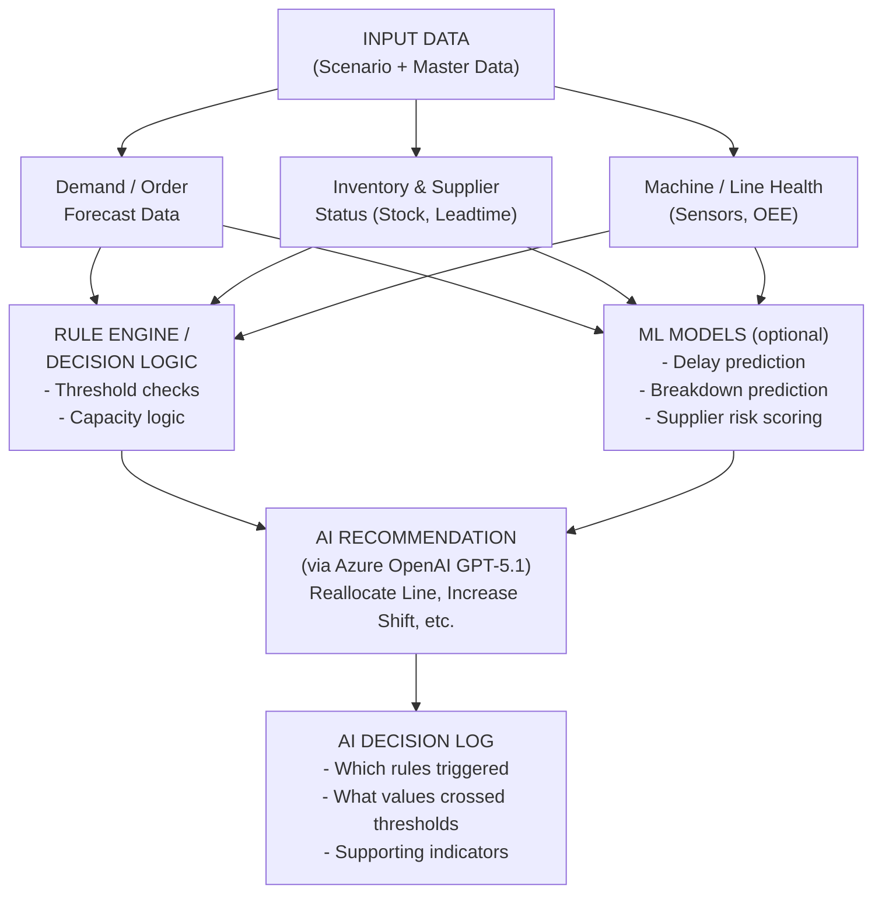

# Use Case 3: AI Decision Engine Rebuild

## Architecture Overview (from Guidance Call)




**AI Recommendation Logic** (deterministic mapping from the diagram):

- Demand spike -> Increase shift
- Chip delay -> Switch supplier
- Low machine health -> Dispatch maintenance
- Overload -> Reallocate line
- Low inventory -> Raise supply alert
- Nothing unusual -> None

## Use Case 3: Afternoon Line Breakdown

**Event**: HighRange_1 assembly line robot malfunction at 3:45 PM (Shift B)

- Affected Line: HighRange_1 (100 units/day capacity lost)
- Estimated Repair: 4-6 hours
- Workaround Options: Line_Swap, Manual_Operation
- Impact Level: HIGH

**Data Source**: Test_Data sheet (200 records) from `Pune_EV_SUV_Plant_Simulation_Data_Expanded.xlsx`

---

## Changes Required (7 major items)

### 1. Azure OpenAI GPT-5.1 Client

Create [src/utils/azure_openai_client.py](src/utils/azure_openai_client.py) -- a new client using the Azure OpenAI SDK.

- Endpoint: `https://capstonebatch4-resource.cognitiveservices.azure.com/`
- Key: `8wriTBe01exyMoMmeJaxCaBQNQFBESKde2s4A1leLqyScT15R2vTJQQJ99CBACHYHv6XJ3w3AAAAAACOGvnbH`
- Model/Deployment: `gpt-5.1-chat`
- API version: `2024-12-01-preview`
- Must implement the same interface as existing clients (`generate_response()`, `generate_json_response()`)
- Use `from openai import AzureOpenAI` (already have `openai>=1.10.0` installed)
- Add env vars: `AZURE_OPENAI_ENDPOINT`, `AZURE_OPENAI_KEY`, `AZURE_OPENAI_DEPLOYMENT`
- Register as a model option in sidebar and `set_active_llm_client()` flow

### 2. Rule Engine (Deterministic Decision Logic)

Create [src/engine/rule_engine.py](src/engine/rule_engine.py) -- a pure Python rule engine with no LLM dependency.

Rules derived from the architecture diagram and master data thresholds:

- **Machine health rule**: If `Machine_Uptime_%` < 75% for any line -> `DISPATCH_MAINTENANCE`
- **Overload rule**: If production demand > line capacity -> `REALLOCATE_LINE`
- **Demand spike rule**: If demand > avg + 2*std -> `INCREASE_SHIFT`
- **Inventory rule**: If `Inventory_Status_%` < 70% -> `RAISE_SUPPLY_ALERT`
- **Supply rule**: If `Semiconductor_Availability` == "Shortage" -> `SWITCH_SUPPLIER`
- **Line breakdown rule**: If event is Equipment_Failure and uptime drops -> `DISPATCH_MAINTENANCE` + `REALLOCATE_LINE`

Each rule returns a structured `RuleResult` with: rule_name, triggered (bool), condition_breached (string), threshold_value, actual_value, recommendation_action, severity.

For Use Case 3 specifically:

- HighRange_1 uptime drops below threshold -> triggers maintenance dispatch
- HighRange_1 capacity = 0 -> triggers line reallocation to HighRange_2
- Check if remaining capacity (90 units/day) covers pending orders
- Check inventory impact (components already allocated to HighRange_1)
- Check workforce reallocation (workers from HighRange_1 to HighRange_2 or manual ops)

### 3. ML Models (Optional Prediction Layer)

Create [src/engine/ml_models.py](src/engine/ml_models.py) -- simple scikit-learn models trained on simulation data.

Three models matching the architecture diagram:

- **Breakdown Prediction**: Given Machine_Uptime_%, Worker_Availability_%, Production_Output -> predict probability of breakdown in next 4 hours. Use RandomForest or LogisticRegression on the 1000 simulation records.
- **Delay Prediction**: Given Semiconductor_Availability, Inventory_Status_%, Supplier lead times -> predict delivery delay risk. 
- **Supplier Risk Scoring**: Given supplier reliability, lead time, semiconductor status -> score each supplier 0-100.

These models train at app startup on the simulation data and provide prediction scores that feed into the AI recommendation layer. They supplement the Rule Engine with probabilistic insights.

### 4. CrewAI Multi-Agent Orchestration

Add `crewai` and `langchain-openai` to [requirements.txt](requirements.txt).

Create [src/agents/crew_agents.py](src/agents/crew_agents.py) with CrewAI agents:

```python
# Agent roles (matching existing architecture):
# 1. Line Health Analyst - monitors machine uptime, predicts breakdowns
# 2. Production Planner - handles line reallocation, capacity planning
# 3. Inventory Controller - checks stock impact, reorder needs
# 4. Workforce Coordinator - shift reallocation, overtime planning
# 5. Supply Chain Monitor - supplier risk, component availability
# 6. Decision Orchestrator - coordinates all agents, generates final plan
```

Create [src/agents/crew_tasks.py](src/agents/crew_tasks.py) with Use Case 3 specific tasks:

- Task 1: Assess HighRange_1 breakdown severity (Line Health Analyst)
- Task 2: Plan production reallocation (Production Planner)
- Task 3: Check inventory impact (Inventory Controller)
- Task 4: Reallocate workforce (Workforce Coordinator)
- Task 5: Assess supply chain impact (Supply Chain Monitor)
- Task 6: Generate integrated action plan with decision log (Decision Orchestrator)

Each agent receives: Rule Engine results + ML predictions + relevant master data subset.

The CrewAI crew uses Azure OpenAI GPT-5.1 as the LLM backbone via `langchain-openai`'s `AzureChatOpenAI`.

### 5. AI Decision Log

Create [src/engine/decision_log.py](src/engine/decision_log.py) -- structured logging for every AI decision.

Each log entry contains (matching the architecture diagram):

- `decision_id`: Unique ID
- `timestamp`: When the decision was made
- `scenario`: Which use case / event triggered it
- `rules_triggered`: List of rule engine results that fired
- `thresholds_breached`: Which numerical conditions were breached (e.g., "Machine_Uptime_% = 62% < 75% threshold")
- `ml_predictions`: What the ML models predicted (breakdown probability, delay risk)
- `recommendation`: The final AI recommendation
- `reasoning`: Why this recommendation was selected
- `supporting_indicators`: Additional data points that support the decision
- `agent_source`: Which CrewAI agent generated this recommendation
- `expected_impact`: KPI impact estimate

The Decision Log is displayed in the UI as a traceable audit trail, and can be exported to CSV/JSON.

### 6. Refactor the UI (ai_engine.py) for Use Case 3

Update [src/ui/ai_engine.py](src/ui/ai_engine.py) to:

- Add "Azure OpenAI GPT-5.1" as a model option in the sidebar (make it the default/primary)
- Focus the pre-built scenario section on Use Case 3 (Afternoon Line Breakdown)
- Show the architecture flow visually (Input Data -> Rule Engine -> ML Models -> AI Recommendation -> Decision Log)
- Display Rule Engine results prominently (which rules fired, what thresholds were breached)
- Display ML model predictions (breakdown probability, delay risk scores)
- Show CrewAI agent collaboration (which agent said what)
- Show AI Decision Log with full traceability
- Keep the existing agent cards structure but update to show CrewAI agent outputs
- Use dates from Order_Data comprehensively (dispatch dates, lead times) to show delivery impact

### 7. Wire Everything Together

Update [app.py](app.py) to:

- Initialize Azure OpenAI client at startup
- Train ML models on simulation data at startup
- Initialize Rule Engine with master data thresholds
- Initialize CrewAI crew with agents and tasks
- Add "Azure OpenAI" to model selection

The end-to-end flow for Use Case 3:

1. User selects "Afternoon Line Breakdown" scenario
2. System loads Test_Data (200 records) + Event_Line_Breakdown + all master data
3. **Rule Engine** evaluates all rules against the data -> produces fired rules
4. **ML Models** predict breakdown probability, delay risk, supplier scores
5. **CrewAI agents** analyze the situation using Rule Engine results + ML predictions + GPT-5.1
6. **AI Decision Log** captures every decision with full traceability
7. **UI** displays: Executive Summary, Rule Results, ML Predictions, Agent Analysis, Recommendations, Decision Log

---

## Files to Create (new)

- `src/utils/azure_openai_client.py` -- Azure OpenAI GPT-5.1 client
- `src/engine/__init__.py` -- Engine package init
- `src/engine/rule_engine.py` -- Deterministic rule engine
- `src/engine/ml_models.py` -- ML prediction models
- `src/engine/decision_log.py` -- AI decision log
- `src/agents/crew_agents.py` -- CrewAI agent definitions
- `src/agents/crew_tasks.py` -- CrewAI task definitions

## Files to Modify (existing)

- `.env` -- Add Azure OpenAI credentials
- `requirements.txt` -- Add crewai, langchain-openai, scikit-learn
- `app.py` -- Initialize new components, add Azure OpenAI option
- `src/utils/gemini_client.py` -- Register Azure client in active LLM switching
- `src/agents/base_agent.py` -- Support CrewAI integration
- `src/ui/ai_engine.py` -- Restructure for Rule Engine + ML + Decision Log display, focus on Use Case 3

## Files to Keep (unchanged)

- `src/data/enhanced_data_loader.py` -- Data loading works well
- `src/ui/home.py`, `data_explorer.py`, `relationships.py`, `whatif.py`, `master_data.py` -- Other UI tabs unchanged
- All existing agents (`demand_agent.py`, `inventory_agent.py`, etc.) -- Keep as fallback for Gemini/HF models
